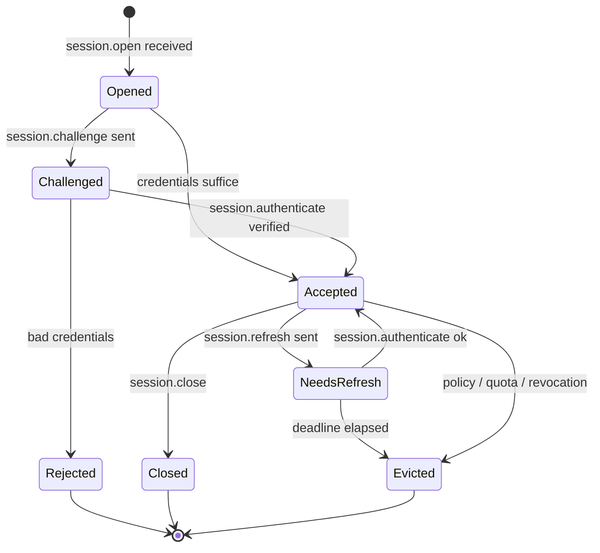
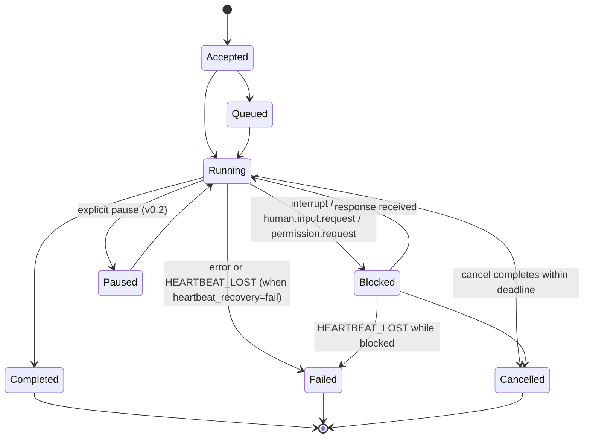
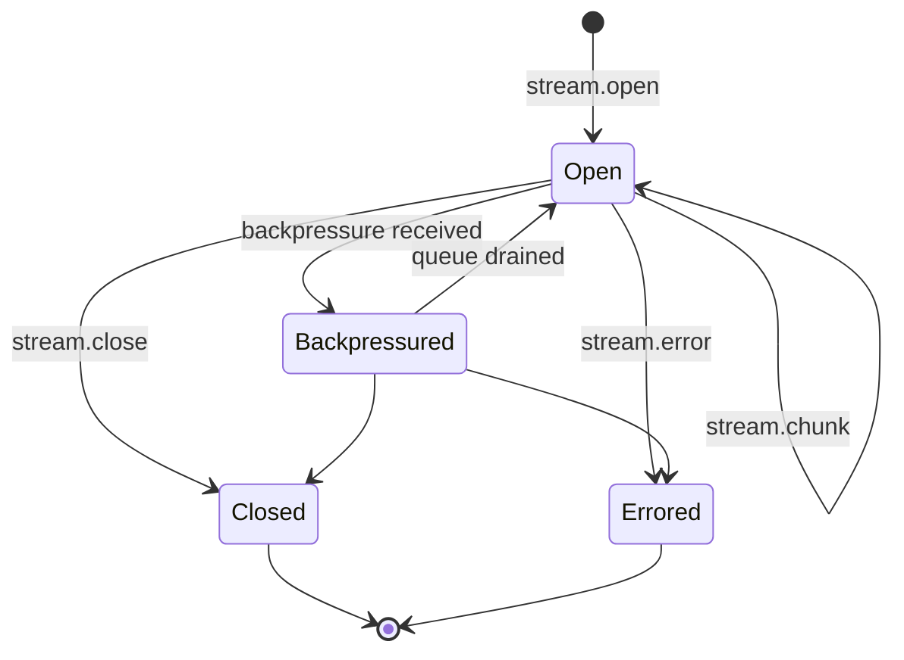
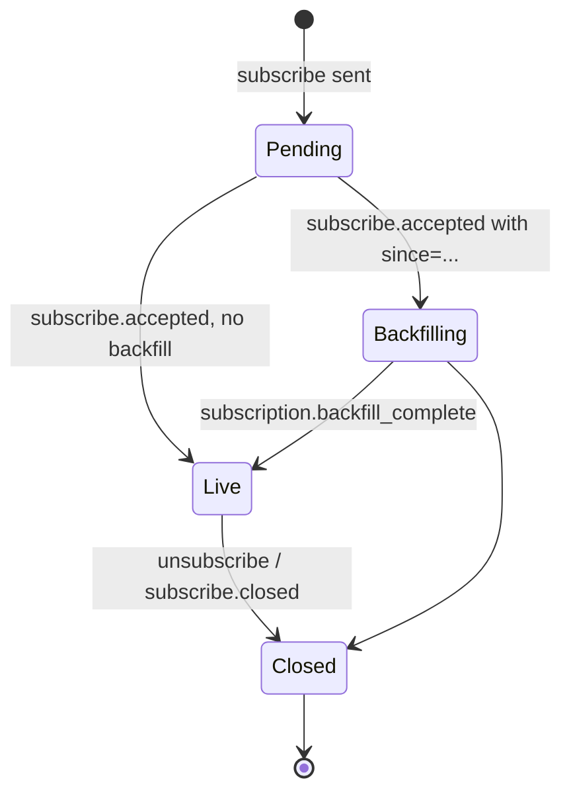
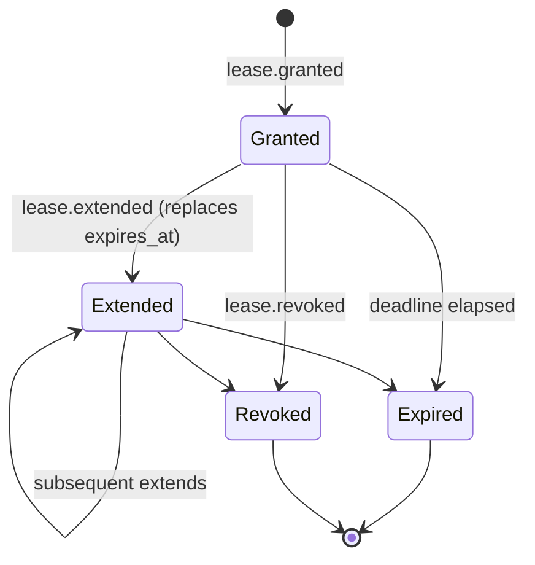

# `arcp` — Build Plan

This is the engineering plan for the Rust reference implementation of ARCP
v1.0. It is the authoritative companion to `RFC-0001-v2.md` (canonical) and
`CONFORMANCE.md` (per-section status). It is updated at every phase gate.

The plan deliberately favours boring, idiomatic Rust over cleverness. Where
the RFC is silent, the chosen interpretation is documented in §A4.

---

## A1. RFC section walk-through

The walk below summarises every protocol-affecting section. Sentences that
constrain implementation are flagged with **[impl]**.

**§1 Goals.** Establishes ARCP as a transport-independent, streaming-first,
durable, authenticated, observable execution protocol. Each goal motivates a
later concrete clause. **[impl]** sets the breadth bar: anything we ship must
read as one of the named goals.

**§2 Non-goals.** Excludes prompt formats, vector stores, model and tool
schemas, UI, identity provider implementations, persistence engines. **[impl]**
the crate exposes the protocol exchange shapes only — not how tokens are
issued, not where artifacts ultimately live.

**§3 Terminology.** Defines Agent, Runtime, Tool, Session, Stream, Job,
Capability, Envelope, Transport, Lease, Subscription, Artifact, Identity,
Heartbeat, Extension, Observer. Used verbatim throughout the codebase as type
and module names.

**§4 Design principles.** Transport-agnostic (§4.1), streaming-native (§4.2),
durable (§4.3), typed contracts (§4.4), event-driven (§4.5), authenticated by
default (§4.6), extensible (§4.7). **[impl]** §4.6 maps directly onto the
type-state pattern: `Session<Unauthenticated>` cannot send protocol traffic.

**§5 Architecture.** Three layers (capability/runtime/transport) and three
client roles (active, observer, peer runtime). **[impl]** observers carry only
subscriptions; surfaced as a separate `Observer` builder on `ARCPClient`.

**§6.1 Envelope.** 18 fields, payload is type-specific. **[impl]** envelope is
a struct holding metadata; payload is a `MessageType` tagged enum dispatched
by serde. `id` is transport idempotency key; `idempotency_key` is logical
intent key (§6.4).

**§6.2 Message types.** Enumerates every type in scope. The plan tabulates
this exhaustively in §A2 below.

**§6.3 Flow.** Commands MAY produce a chain of `ack`/`job.accepted`,
`job.started`, progress/heartbeat/log/metric/checkpoint events, terminating
in exactly one terminal event per the command kind. **[impl]** the runtime
enforces the terminal-event invariant in `runtime/job.rs`.

**§6.4 Delivery.** At-least-once for durable jobs; receivers MUST dedup by
`id`; `idempotency_key` keyed off `(session_principal, idempotency_key)` is
preserved at least until lease horizon. Ordering is per-`stream_id` /
`job_id`. **[impl]** dedup is a UNIQUE constraint on `(session_id, id)` in
the event log; logical dedup is a separate index.

**§6.5 Priority & QoS.** `low|normal|high|critical`; default `normal`. **[impl]**
ordering within `stream_id`/`job_id` MUST NOT be reordered by priority — this
falls out of mpsc channels being per-stream FIFO.

**§7 Capability negotiation.** Booleans default to `false`; required-but-
unsupported responds `session.rejected` with `code: UNIMPLEMENTED`. **[impl]**
`Capabilities` is a struct with `Option<bool>` fields; missing means false at
read time, omitted on serialise.

**§8.1 Handshake.** Four-message handshake;
non-handshake messages received pre-acceptance MUST be dropped and logged.
**[impl]** the runtime rejects them by message-type whitelist while session is
in `Unauthenticated`.

**§8.2 Credentials.** Five schemes — bearer/mtls/oauth2/signed_jwt/none. v0.1
ships bearer/signed_jwt/none.

**§8.3 Runtime identity.** Runtime emits its identity in `session.accepted`
with `kind`, `version`, `fingerprint`, `trust_level`. **[impl]** crate exposes
`IMPL_KIND = "arcp-rs"` and `IMPL_VERSION` from `Cargo.toml`.

**§8.4–§8.5 Refresh & eviction.** `session.refresh` requires fresh
authenticate before deadline; eviction emits `session.evicted` with reason
code from §18 taxonomy.

**§9 Sessions.** Stateless / stateful / durable. v0.1: stateless and stateful;
durable across reconnect (i.e. resume) is intentionally minimal —
message-id-only resume per §19.

**§10.1–§10.2 Jobs / states.** 8 states: accepted/queued/running/blocked/
paused/completed/failed/cancelled. Exactly one terminal per job. **[impl]**
state lives as a Rust enum with explicit transition methods returning
`Result<NewState, FAILED_PRECONDITION>`.

**§10.3 Heartbeats.** `heartbeat_interval_seconds`, default 30; default `N=2`
missed deadlines transitions to `failed` (`HEARTBEAT_LOST`) or `blocked`,
keyed by advertised `heartbeat_recovery: "fail" | "block"` capability.

**§10.4 Cancellation.** Cooperative; `cancel.accepted` then terminal within
deadline; escalation to hard kill emits `ABORTED`.

**§10.5 Interrupts.** Distinct from cancel: target → `blocked`, emit
`human.input.request`, resume on response or explicit cancel.

**§10.6 Scheduled jobs.** v0.2.

**§11.1 Stream kinds.** `text|binary|event|log|metric|thought`. Unknown → `event`.

**§11.2 Backpressure.** `backpressure` carries desired rate / buffer / reason.
**[impl]** bounded mpsc + a `BackpressureSink` adapter on the writer side.

**§11.3 Binary encoding.** v0.1 = base64 only. Capability advertises
`["base64"]`.

**§11.4 Reasoning streams.** `kind: thought` chunks with `role`, `content`,
`redacted`. Subscribers MAY filter.

**§12.1–§12.2 Human input / choice.** Request carries `prompt`,
`response_schema` (input only), optional `default`, `expires_at`. Response
carries the value plus provenance.

**§12.3 Provenance.** Default first-response-wins; v0.1 implements only the
default. Stale prompts cleared via `human.input.cancelled`.

**§12.4 Expiration.** Default → synthesise response with
`responded_by: "default"`. Otherwise emit `human.input.cancelled` with
`DEADLINE_EXCEEDED`.

**§13.1–§13.4 Subscriptions.** Filters AND across fields, OR within array.
Backfill ends with synthetic `subscription.backfill_complete`. Either side
can `unsubscribe`; runtime can `subscribe.closed`.

**§14 Multi-agent.** v0.2.

**§15 Permissions, sandboxing, trust, leases.** Permission challenge → grant
materialises a `lease.granted`; lease can be refreshed/extended/revoked;
operations against expired/revoked lease are `PERMISSION_DENIED`. **[impl]**
trust elevation is v0.2.

**§16 Artifacts.** Inline base64 in v0.1. `artifact.put/fetch/ref/release`.
Retention sweep on a `tokio::time::interval` task; expired → `NOT_FOUND`.

**§17 Observability.** `trace_id`/`span_id` everywhere, mapped onto
`tracing::Span`. Standard metric names exported as `&'static str` constants
in `messages/telemetry.rs` so users can avoid string typos.

**§18 Errors.** Canonical codes as `#[non_exhaustive]` enum; `ARCPError`
single source of truth; `code()` and `retryable()` methods.

**§19 Resumability.** v0.1: `after_message_id` only. Retention expiry → emit
`DATA_LOSS`.

**§20 MCP compatibility.** Advisory; nothing to implement directly.

**§21 Extensions.** Namespacing rules enforced at `ExtensionRegistry`.
Unknown messages: `nack` with `UNIMPLEMENTED` unless `extensions.optional:
true` for namespaced types.

**§22 Reference transports.** WebSocket and stdio mandatory, both shipped.

**§23 Example lifecycle.** Non-normative; drives the `e2e_relay_scenario`
integration test.

**§24 Example invocation.** Non-normative; canonical examples become `insta`
snapshot tests in Phase 1.

**§25 Real-world examples.** Non-normative; the `examples/` programs match
the named scenarios.

**§26 Future work.** Out of scope.

**§27–§28 Why ARCP / motto.** Non-normative.

---

## A2. Message-type → module map

Every in-scope envelope type, the module that owns it, and the Rust type
that represents the payload. Payloads live behind `MessageType::<Variant>(Payload)`
in [`src/messages/mod.rs`](src/messages/mod.rs).

### Identity & authentication — `messages/session.rs`

| Wire type                  | Rust payload                  |
| -------------------------- | ----------------------------- |
| `session.open`             | `SessionOpenPayload`          |
| `session.challenge`        | `SessionChallengePayload`     |
| `session.authenticate`     | `SessionAuthenticatePayload`  |
| `session.accepted`         | `SessionAcceptedPayload`      |
| `session.unauthenticated`  | `SessionUnauthenticatedPayload` |
| `session.rejected`         | `SessionRejectedPayload`      |
| `session.refresh`          | `SessionRefreshPayload`       |
| `session.evicted`          | `SessionEvictedPayload`       |
| `session.close`            | `SessionClosePayload`         |

### Control — `messages/control.rs`

| Wire type            | Rust payload         |
| -------------------- | -------------------- |
| `ping`               | `PingPayload`        |
| `pong`               | `PongPayload`        |
| `ack`                | `AckPayload`         |
| `nack`               | `NackPayload`        |
| `cancel`             | `CancelPayload`      |
| `cancel.accepted`    | `CancelAcceptedPayload` |
| `cancel.refused`     | `CancelRefusedPayload` |
| `interrupt`          | `InterruptPayload`   |
| `resume`             | `ResumePayload`      |
| `backpressure`       | `BackpressurePayload` |
| `checkpoint.create`  | `CheckpointCreatePayload`  *(v0.2)* |
| `checkpoint.restore` | `CheckpointRestorePayload` *(v0.2)* |

### Execution — `messages/execution.rs`

| Wire type             | Rust payload         |
| --------------------- | -------------------- |
| `tool.invoke`         | `ToolInvokePayload`  |
| `tool.result`         | `ToolResultPayload`  |
| `tool.error`          | `ToolErrorPayload`   |
| `job.accepted`        | `JobAcceptedPayload` |
| `job.started`         | `JobStartedPayload`  |
| `job.progress`        | `JobProgressPayload` |
| `job.heartbeat`       | `JobHeartbeatPayload` |
| `job.checkpoint`      | `JobCheckpointPayload` *(v0.2)* |
| `job.completed`       | `JobCompletedPayload` |
| `job.failed`          | `JobFailedPayload`   |
| `job.cancelled`       | `JobCancelledPayload` |
| `job.schedule`        | `JobSchedulePayload` *(stub: returns UNIMPLEMENTED)* |
| `workflow.start`      | *(stub: UNIMPLEMENTED)* |
| `workflow.complete`   | *(stub: UNIMPLEMENTED)* |
| `agent.delegate`      | *(stub: UNIMPLEMENTED)* |
| `agent.handoff`       | *(stub: UNIMPLEMENTED)* |

### Streaming — `messages/streaming.rs`

| Wire type      | Rust payload         |
| -------------- | -------------------- |
| `stream.open`  | `StreamOpenPayload`  |
| `stream.chunk` | `StreamChunkPayload` |
| `stream.close` | `StreamClosePayload` |
| `stream.error` | `StreamErrorPayload` |

### Human-in-the-loop — `messages/human.rs`

| Wire type                  | Rust payload                  |
| -------------------------- | ----------------------------- |
| `human.input.request`      | `HumanInputRequestPayload`    |
| `human.input.response`     | `HumanInputResponsePayload`   |
| `human.choice.request`     | `HumanChoiceRequestPayload`   |
| `human.choice.response`    | `HumanChoiceResponsePayload`  |
| `human.input.cancelled`    | `HumanInputCancelledPayload`  |

### Permissions & leases — `messages/permissions.rs`

| Wire type              | Rust payload              |
| ---------------------- | ------------------------- |
| `permission.request`   | `PermissionRequestPayload` |
| `permission.grant`     | `PermissionGrantPayload`   |
| `permission.deny`      | `PermissionDenyPayload`    |
| `lease.granted`        | `LeaseGrantedPayload`      |
| `lease.extended`       | `LeaseExtendedPayload`     |
| `lease.revoked`        | `LeaseRevokedPayload`      |
| `lease.refresh`        | `LeaseRefreshPayload`      |

### Subscriptions — `messages/subscriptions.rs`

| Wire type             | Rust payload             |
| --------------------- | ------------------------ |
| `subscribe`           | `SubscribePayload`       |
| `subscribe.accepted`  | `SubscribeAcceptedPayload` |
| `subscribe.event`     | `SubscribeEventPayload`  |
| `unsubscribe`         | `UnsubscribePayload`     |
| `subscribe.closed`    | `SubscribeClosedPayload` |

### Artifacts — `messages/artifacts.rs`

| Wire type          | Rust payload          |
| ------------------ | --------------------- |
| `artifact.put`     | `ArtifactPutPayload`  |
| `artifact.fetch`   | `ArtifactFetchPayload` |
| `artifact.ref`     | `ArtifactRefPayload`  |
| `artifact.release` | `ArtifactReleasePayload` |

### Telemetry — `messages/telemetry.rs`

| Wire type     | Rust payload      |
| ------------- | ----------------- |
| `event.emit`  | `EventEmitPayload` |
| `log`         | `LogPayload`      |
| `metric`      | `MetricPayload`   |
| `trace.span`  | `TraceSpanPayload` |

The synthetic `subscription.backfill_complete` payload (carried inside an
`event.emit`) is a known string constant.

---

## A3. State machines

Five state machines drive the runtime. The diagrams below are the source of
truth for the corresponding Rust types' transition methods.

### A3.1 Session

In Rust this is a type-state: `Session<Opened>`, `Session<Challenged>`,
`Session<Accepted>`, `Session<Closed>`. Only `Session<Accepted>` exposes the
business methods (`invoke`, `subscribe`, `request_human_input`, …).

### A3.2 Job

Encoded as `enum JobState` with `Job::transition(&mut self, JobEvent)
-> Result<JobState, ARCPError>` enforcing legality. Terminal states are
sealed: a transition out of `Completed` / `Failed` / `Cancelled` returns
`FAILED_PRECONDITION`.

### A3.3 Stream

`StreamWriter` owns the producer side; `StreamReader: Stream<Item=StreamChunk>`
the consumer side. Backpressure is implicit in the bounded mpsc; the
`Backpressured` state is observable via a watcher channel for telemetry.

### A3.4 Subscription

Backfill is a `Stream` chained with a `tokio::sync::broadcast::Receiver`
adapter. The boundary marker is synthesised by the runtime, not the store.

### A3.5 Lease

`LeaseManager` keeps an in-memory map keyed by `LeaseId` and a per-lease
`tokio::time::Sleep` future for expiry; cancellation by `lease.revoked`
drops both, after which any operation referencing the lease returns
`ARCPError::LeaseExpired` or `LeaseRevoked`.

---

## A4. Open questions and chosen interpretations

The RFC is mostly explicit, but a few corners need a deliberate call. Each
of these is annotated with the section reference, the gap, and the choice
this implementation makes.

1. **§6.1 `arcp` field type.** Listed as "protocol version understood by the
   sender" without a format restriction. **Choice:** dotted `MAJOR.MINOR`
   string; v0.1 always emits `"1.0"`; on receive we accept any string and
   defer compatibility checks to capability negotiation.

2. **§6.4 `id` format.** RFC examples use `msg_01JABC` (looks like a
   ULID-prefixed token) but no format is mandated. **Choice:** all newtype
   ids are `<prefix>_<ULID>` (`msg_`, `sess_`, `job_`, `str_`, `sub_`,
   `art_`, `lease_`). Prefix asserted on parse.

3. **§6.4 logical idempotency horizon.** "At least the lease horizon" leaves
   the actual TTL undefined. **Choice:** v0.1 retains `(session_principal,
   idempotency_key) -> message_id` rows in the event log for 24h, after
   which the row is GC'd by the same sweep that handles artifact retention.

4. **§7 capability defaults.** RFC says absent booleans are false but does
   not enumerate every capability. **Choice:** the `Capabilities` struct
   covers exactly the booleans named in §7 plus `heartbeat_recovery`,
   `binary_encoding`, `anonymous`, `interrupt`, `extensions`. Unknown
   capabilities advertised by the peer are preserved verbatim under
   `extra: BTreeMap<String, serde_json::Value>` and ignored by the runtime.

5. **§8.2 `client.fingerprint` for `mtls`.** RFC requires fingerprint be
   present. v0.1 doesn't ship `mtls`, so this is moot until v0.2.

6. **§10.3 heartbeat `deadline_ms`.** Per-heartbeat deadline is informational
   in the example; the RFC's hard deadline is the negotiated interval. **Choice:**
   we honour the larger of the negotiated interval and the per-heartbeat
   `deadline_ms` when scheduling the watchdog reset.

7. **§10.4 cancellation deadline default.** Unspecified. **Choice:** if
   `deadline_ms` is omitted, default to 5_000 ms.

8. **§11.2 `backpressure.desired_rate_per_second`.** Unit ambiguity (chunks
   vs. bytes). **Choice:** chunks per second. Bytes would make the field
   redundant with `buffer_remaining_bytes`.

9. **§12.1 `response_schema` validator.** RFC declines to mandate a schema
   dialect. **Choice:** JSON Schema draft 2020-12, validated via `jsonschema`
   crate (added to deps with a justification — see §A6).

10. **§13.2 filter authorization.** Says runtimes MUST reject unauthorized
    filters with `PERMISSION_DENIED` but does not say what counts as
    authorization. **Choice:** v0.1 authorizes a subscription if any of
    `session_id` / `trace_id` / `job_id` / `stream_id` listed in the filter
    is owned by the subscribing session's principal. Filters that omit all
    four are accepted only if the principal carries a synthetic
    `subscriptions.global` permission lease.

11. **§16.2 inline `artifact.put` size cap.** Unspecified. **Choice:** 4 MiB
    after base64 decode in v0.1; oversized → `INVALID_ARGUMENT`.

12. **§16.3 retention sweep cadence.** Unspecified. **Choice:** sweep every
    60 s; configurable via runtime builder.

13. **§19 retention window for replay.** Unspecified. **Choice:** 7 days; the
    sweep that handles artifact + idempotency GC also drops events older
    than this.

14. **§21.3 unknown-message handling for stream chunks.** Stream chunks
    addressed to unknown stream ids. **Choice:** reply once with `nack`
    (`NOT_FOUND`) per `stream_id`, then drop further chunks for the same
    id silently for 60 s to avoid amplification.

15. **CLI default port.** §22 doesn't standardise. **Choice:** WebSocket
    binds to `127.0.0.1:7777` by default; documented in `--help`.

Each of these decisions appears in code as a `// RFC §X.Y choice:` comment
at the implementation site so a future reader can find and challenge it.

---

## A5. Test plan

Integration tests live under `tests/`. Each file is its own crate, each
parameterised over the in-memory transport at minimum and (after Phase 6)
also WebSocket and stdio. Helpers come from `tests/common/mod.rs` which
exposes `spawn_runtime() -> (Runtime, ClientFactory)`.

| Test file                  | Phase | Surface exercised | Scenario |
| -------------------------- | ----- | ----------------- | -------- |
| `handshake.rs`             | 2     | §8.1, §7, §8.2    | Happy path; bad token → `session.rejected`; required-but-unsupported capability → `UNIMPLEMENTED`; anonymous accepted only when negotiated; pre-acceptance command dropped; replayed `id` rejected. |
| `job_lifecycle.rs`         | 3     | §10.1–§10.3, §6.3 | Accepted → running → completed; failure path with retryable code; heartbeat watchdog under `tokio::time::pause`/`advance`; `heartbeat_recovery=block` honoured; `heartbeat_recovery=fail` emits `HEARTBEAT_LOST`. |
| `cancellation.rs`          | 3     | §10.4             | `cancel.accepted` path; `cancel.refused` for terminal-state job; deadline elapsed → hard kill with `ABORTED`. |
| `interrupt.rs`             | 3     | §10.5             | Interrupt → blocked → `human.input.request` → response → resume. |
| `human_input.rs`           | 4     | §12.1–§12.4       | Input round-trip with schema validation; choice round-trip; expiration + default; expiration without default → `DEADLINE_EXCEEDED`. |
| `permission_lease.rs`      | 4     | §15.4–§15.5       | Permission challenge → grant → lease materialised → operation succeeds; lease expiry → `LEASE_EXPIRED`; lease revocation → `LEASE_REVOKED`. |
| `subscription.rs`          | 5     | §13.1–§13.4       | Filter combinations (AND across, OR within); backfill ordering; backfill→live boundary marker; subscription dropped on auth expiry. |
| `artifact.rs`              | 5     | §16               | `put` (inline) → `fetch` round-trip; `ref` round-trip; `release` GC; retention sweep expiry → `NOT_FOUND`. |
| `resume.rs`                | 5     | §19               | Resume across forced disconnect with no message gap; resume past retention horizon → `DATA_LOSS`. |
| `extension_unknown.rs`     | 1+5   | §21.3             | Core type unknown → `UNIMPLEMENTED`; namespaced + `extensions.optional=true` → silent drop; namespaced + non-optional → `UNIMPLEMENTED`. |
| `e2e_relay_scenario.rs`    | 7     | §23, §25          | Runtime + agent client + observer client. Agent invokes a tool; runtime requests human input; observer (acting as human) responds; agent produces an artifact and completes. Run against both WS and stdio transports. |

Unit tests (`#[cfg(test)]` blocks) cover envelope round-trip per variant,
ID prefix parsing, error code coverage, lease lifecycle invariants, the
backpressure adapter, the JSON-Schema validator wrapper, and the event-log
dedup invariant.

Snapshot tests via `insta`: every canonical envelope from the RFC is asserted
verbatim under `tests/snapshots/`, so any future serialisation change is a
loud diff.

Property tests (out of scope for v0.1, noted for v0.2): envelope round-trip
under `quickcheck`; job state-machine reachability; subscription filter
algebra.

Loom tests (v0.2 candidate): heartbeat/cancellation interleavings.

---

## A6. Rust-specific design choices

The single biggest leverage point in Rust here is the type system. The
choices below are the ones that make the implementation small.

**Tagged enum envelope.** `MessageType` is a `#[serde(tag = "type")]`
`#[non_exhaustive]` enum. serde routes by the wire-level discriminator. The
compiler then forces every dispatcher (runtime, client, snapshot tests) to
match exhaustively or `_ => unreachable!()` with explicit reasoning. There is
no need for a runtime validator like pydantic / zod.

**Type-state sessions.** `Session<S: SessionState>` has `S` ∈
`Opened`/`Challenged`/`Accepted`/`Closed`. `Session<Accepted>::invoke(...)`
exists; `Session<Opened>::invoke(...)` does not. §4.6 ("authenticated by
default") becomes a compile-time guarantee.

**Newtype IDs.** Every `*_id` field is its own newtype with `Display`,
`FromStr`, `Serialize`, `Deserialize`, `Hash`, `Eq`, `Ord`. `SessionId`
cannot be passed where `MessageId` is expected. Each newtype has a `new()`
that mints a `<prefix>_<ULID>`; ULIDs give monotonic ids without an extra
counter. (cf. §A4.2)

**Cancellation = `CancellationToken`.** Every job, stream, subscription, and
pending request holds a `tokio_util::sync::CancellationToken`. Composes via
`child_token`; integrates cleanly with `tokio::select!`. Cooperative cancel
polls the token at checkpoints; hard kill cancels the `JoinHandle`.

**Pending registry.** `DashMap<MessageId, PendingEntry>` where `PendingEntry`
holds `oneshot::Sender<MessageType>`, deadline, cancellation token. One-shot
is exactly the right primitive for request/response.

**Streams = `tokio::sync::mpsc`.** Bounded mpsc gives backpressure for free
at the channel boundary. `StreamWriter::send().await` blocks the producer
when the consumer can't keep up; the runtime turns that observed pressure
into a `backpressure` envelope on the wire (§11.2).

**Subscriptions = backfill `Stream` chained with `broadcast`.** The backfill
half is a `tokio_stream::wrappers::ReceiverStream` over a per-subscription
mpsc that drains the SQLite event log. The live tail is a
`tokio::sync::broadcast::Receiver`. Chaining with `futures::stream::chain`
yields one continuous `impl Stream<Item = Envelope>`. The synthetic
`subscription.backfill_complete` envelope is emitted at the boundary.

**Tracing.** `#[instrument]` everywhere. On envelope receipt the runtime
re-enters the span with the wire-level `trace_id`/`span_id`, so downstream
work nests under the original trace. No exporter in v0.1 — IDs are
preserved, that's all the RFC requires.

**SQLite event log.** `rusqlite` with `bundled` so consumers don't need a
system SQLite. Sync calls go through a small `spawn_blocking` facade in
`store/eventlog.rs`. Unique constraint on `(session_id, id)` is the dedup
mechanism.

**Errors.** `thiserror` for `ARCPError`. Variants align 1:1 with the §18
canonical codes plus `Unimplemented { section, detail }`. `From` impls for
`rusqlite::Error`, `serde_json::Error`, `jsonwebtoken::errors::Error` are
the only library-error trust boundaries. No `Box<dyn Error>` or `anyhow` in
the public API.

**No global state.** Everything reachable from `ARCPRuntime` or `ARCPClient`.
`std::sync::OnceLock` is used only for one item: the static
`ExtensionRegistry::core()` which holds the namespacing regex.

---

## A7. Phase-by-phase deliverables (recap)

| Phase | Focus                                    | Gate file evidence |
| ----- | ---------------------------------------- | ------------------ |
| 0     | Skeleton + plan                          | `PLAN.md`, `Cargo.toml`, lib + bin compile, gates green |
| 1     | Envelope, errors, extensions, event log  | snapshot tests, dedup tests |
| 2     | Messages, handshake, capabilities        | handshake integration tests |
| 3     | Jobs, streams, cancel, interrupt         | lifecycle + heartbeat tests, deterministic time |
| 4     | Human-in-the-loop, permissions, leases   | round-trip tests; <50 ms p99 in-process |
| 5     | Subscriptions, artifacts, resume         | backfill boundary test; resume across kill |
| 6     | Transports                               | full test suite green over WS, stdio, memory |
| 7     | CLI, examples, docs                      | examples run; coverage ≥85%; cargo publish dry-run |

---

## A8. Dependency justifications

The starting set comes from the build prompt. Two additions during planning:

1. **`jsonschema`** (planned for Phase 4). Required to validate
   `human.input.response.payload.value` against the request's
   `response_schema`. The RFC mandates validation; there is no smaller
   crate that handles JSON Schema draft 2020-12. Added when Phase 4 starts.

2. **No others.** No `actix`, `warp`, `axum`, `serde_yaml`, `lazy_static`,
   `derive_more`, `eyre`, `anyhow`. `cargo deny` is configured to enforce
   that `anyhow`, `eyre`, and `lazy_static` cannot enter the dependency
   graph.

---

## A9. Lints

Crate-level lints (in `Cargo.toml`):

- `unsafe_code = "deny"` (non-negotiable).
- `missing_docs = "deny"` (every `pub` item documented).
- `unreachable_pub = "warn"`.
- `clippy::pedantic` and `clippy::nursery` at `warn`.
- `clippy::unwrap_used = "deny"` (libs MUST NOT panic on Ok-only paths).
- `clippy::expect_used = "warn"` (allowed only with documented invariant).
- `clippy::panic`, `todo`, `unimplemented` = `deny`.
- `clippy::module_name_repetitions = "allow"` — protocol modules
  legitimately produce names like `messages::session::SessionOpenPayload`.
- `clippy::multiple_crate_versions = "allow"` — at this scale of dep tree,
  duplicates are inevitable; `cargo deny`'s `multiple-versions = "warn"`
  surfaces them at the gate without breaking it.

Site-level `#[allow(clippy::xxx)]` is acceptable with a one-line rationale.
Blanket allows beyond the two above must be justified here before landing.
