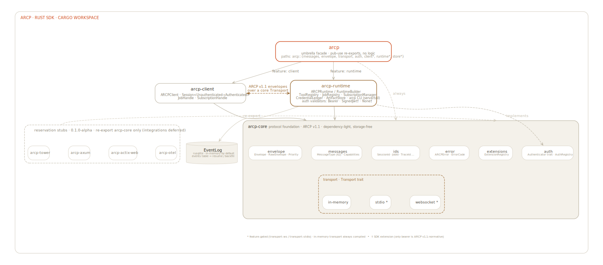

# ARCP Rust SDK documentation

Reference docs for the Rust [`arcp`](https://docs.rs/arcp) crate. The
[top-level README](../README.md) is the front door; these pages go deeper into
each subsystem and map back to the
[ARCP v1.1 specification](../../spec/docs/draft-arcp-1.1.md).

<picture>
  <source media="(prefers-color-scheme: dark)" srcset="diagrams/architecture-dark.svg">
  
</picture>

## Start here

- [Getting started](./getting-started.md) - install, build a runtime + client, run the examples.
- [Architecture](./architecture.md) - how the `arcp` workspace (umbrella `arcp` crate plus `arcp-core` / `arcp-client` / `arcp-runtime` plus reservation stubs) is organized.
- [Transports](./transports.md) - WebSocket, stdio, in-memory; when to pick each.
- [CLI](./cli.md) - the `arcp` binary shipped by the crate.

## Guides (one per spec section)

| Page | Spec |
| --- | --- |
| [Sessions](./guides/sessions.md) | §6 |
| [Resume](./guides/resume.md) | §6.3 |
| [Authentication](./guides/auth.md) | §6.1 |
| [Jobs](./guides/jobs.md) | §7 |
| [Job events](./guides/job-events.md) | §8 |
| [Leases](./guides/leases.md) | §9 |
| [Delegation](./guides/delegation.md) | §10 |
| [Observability](./guides/observability.md) | §11 |
| [Errors](./guides/errors.md) | §12 |
| [Vendor extensions](./guides/vendor-extensions.md) | §15 |

## Reference

- [Recipes](./recipes.md) - copy-paste solutions to common Rust SDK tasks.
- [Conformance](./conformance.md) - spec coverage by section.
- [Troubleshooting](./troubleshooting.md) - error codes, build issues, and runtime failure modes.

## Diagrams

The architecture diagram is generated from Graphviz. Sources and rendering
instructions live in [`diagrams/README.md`](./diagrams/README.md); light and
dark variants render through GitHub's `<picture>` element with
`prefers-color-scheme`.
